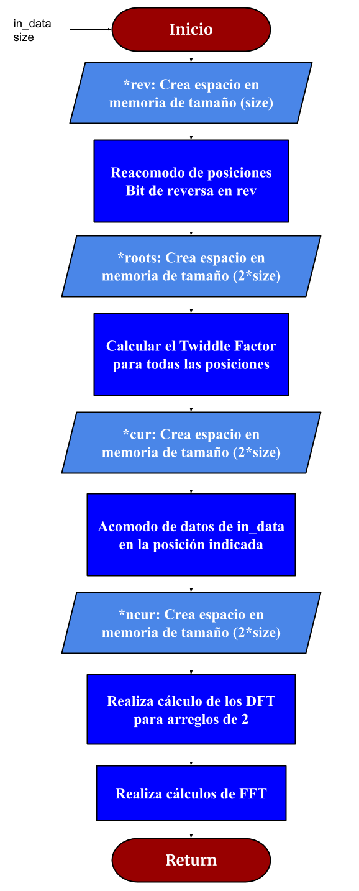
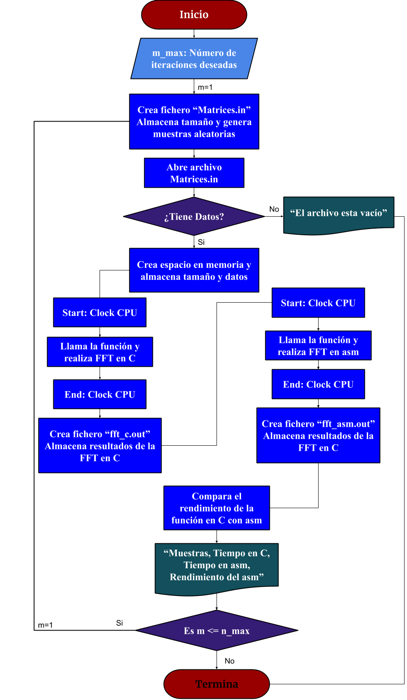

 En el siguiente diagrama se presenta el flujo utilizado para la programación de la transformada rápida de Fourier utilizada en el archivo ensamblador
  
 
 
 En el último diagrama se adjunta el flujo de la programación en C que se utilizó para realizar el benchmarking del proyecto
  
